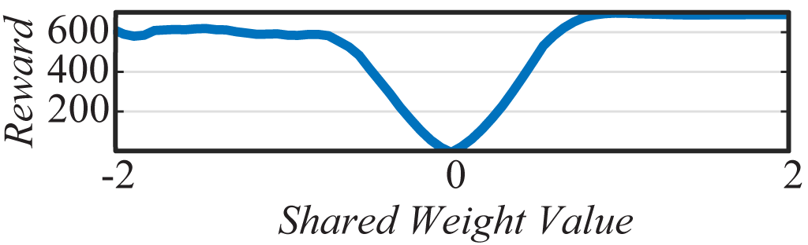
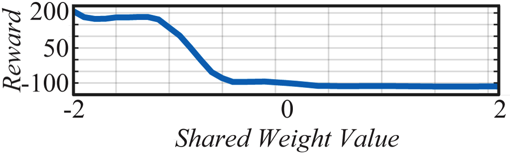
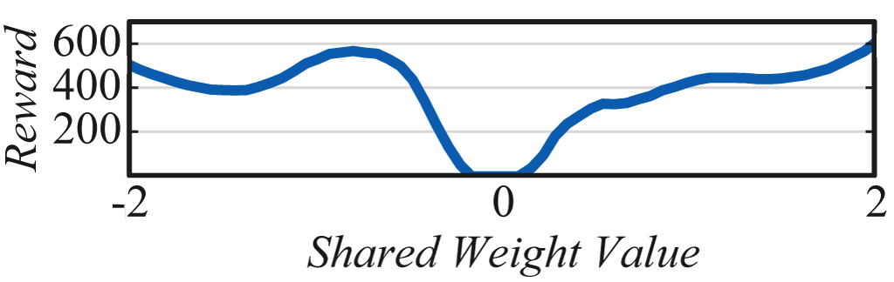
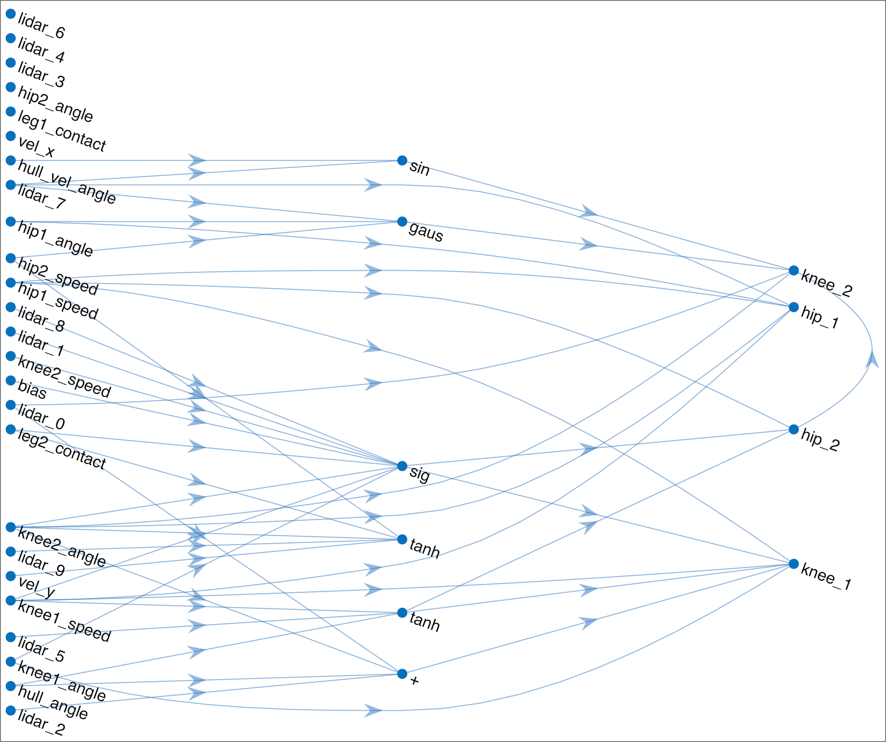

## Acknowledgements

We would like to thank Douglas Eck, Geoffrey Hinton, Anja Austermann, Jeff Dean, Luke Metz, Ben Poole, Jean-Baptiste Mouret, Michiel Adriaan Unico Bacchiani, Heiga Zen, and Alexander M. Lamb for their thoughtful feedback.

The experiments in this work were performed on 96-core CPU Linux virtual machines provided by [Google Cloud Platform](https://cloud.google.com/).

This article was prepared using the [Distill](https://distill.pub) [template](https://github.com/distillpub/template). Interactive demos were built with [p5.js](https://p5js.org).

Any errors here are our own and do not reflect opinions of our proofreaders and colleagues. If you see mistakes or want to suggest changes, feel free to contribute feedback by participating in the discussion [forum](https://github.com/weightagnostic/weightagnostic.github.io/issues) for this article.

<h3 id="citation">Citation</h3>

For attribution in academic contexts, please cite this work as

<pre class="citation short">Adam Gaier and David Ha, "Weight Agnostic Neural Networks", 2019.</pre>

BibTeX citation

<pre class="citation long">@article{wann2019,
  author = {Adam Gaier and David Ha},
  title  = {Weight Agnostic Neural Networks},
  eprint = {arXiv:1906.04358},
  url    = {https://weightagnostic.github.io},
  note   = "\url{https://weightagnostic.github.io}",
  year   = {2019}
}</pre>

## Open Source Code

We release a general purpose tool, not only to facilitate reproduction, but also for further research in this direction. Our NumPy <dt-cite key="van2011numpy"></dt-cite> implementation of NEAT <dt-cite key="neat"></dt-cite> supports MPI <dt-cite key="mpi_library"></dt-cite> and OpenAI Gym <dt-cite key="openai_gym"></dt-cite> environments.

Please see our [repo](https://github.com/google/brain-tokyo-workshop/tree/master/WANNRelease) for details about the code release.

## Reuse

Diagrams and text are licensed under Creative Commons Attribution [CC-BY 4.0](https://creativecommons.org/licenses/by/4.0/) with the [source available on GitHub](https://github.com/weightagnostic/weightagnostic.github.io), unless noted otherwise. The figures that have been reused from other sources don’t fall under this license and can be recognized by the citations in their caption.

## Supplementary Materials

For further discussion about the implementation details of the experiments, and results for multiple independent runs of the search algorithms, please refer to the Supplementary Materials section in the [pdf](https://arxiv.org/abs/1906.04358) version of this article.

## “Have you also thought about trying ... ?”

In this section, we highlight things that we have attempted, but did not explore in sufficient depth.

### Searching for network architecture using a single weight rather than range of weights.

We experimented with setting all weights to a single fixed value, e.g. 0.7, and saw that the search is faster and the end result better. However, if we then nudge that value by a small amount, to say 0.6, the network fails completely at the task. By training on a wide range of weight parameters, akin to training on uniform samples weight values, networks were able to perform outside of the training values. In fact, the best performing values were outside of this training set.

### Searching for network architecture using random weights for each connection.

This was the first thing we tried, and did not have much luck. We tried quite a few things to get this to work--at one point it seemed like we finally had it, poles were balanced and walkers walking, but it turned out to be a bug in the code! Instead of setting all of the weights to different random values we had set all of the weights to the *same* random value. It was in the course of trying to understand this result that we began to view and approach the problem through the lens of MDL and AIT.

### Adding noise to the single weight values.

We experimented adding Gaussian noise to the weight values so that each weight would be different, but vary around a set mean at each rollout. We only did limited experiments on swing-up and found no large difference, except with very high levels of noise where it performed poorly. Our intuition is that adding noise would make the final topologies even more robust to changes in weight value, but at the cost of making the evaluation of topologies more noisy (or more rollouts to mitigate the variance between trials). With no clear benefit we chose to keep the approach as conceptually simple as possible--but see this as a logical next step towards making the networks more weight tolerant.

### Using backpropagation to fine-tune weights of a WANN.

We explored the use of autograd packages such as <dt-cite key="jax_library">JAX</dt-cite> to fine-tune individual weights of WANNs for the MNIST experiment. Performance improved, but ultimately we find that black-box optimization methods such as CMA-ES and population-based REINFORCE can find better solutions for the WANN architectures evolved for MNIST, suggesting that the various activations proposed by the WANN search algorithm may have produced optimization landscapes that are more difficult for gradient-based methods to traverse compared to standard ReLU-based deep network architectures.

### Why did you choose to use many different activation functions in the same network? Why not just ReLU? Wouldn't too many activations break biological plausibility?

Without concrete weight values to lean on, we instead relied on encoding relationships between inputs into the network. This could have been done with ReLUs or sigmoids, but including relationships such as symmetry and repetition allow for more compact networks.

We didn't do much experimentation, but our intuition is that the variety of activations is key. That is not to say that all of them are necessary, but we're not confident this could have been accomplished with only linear activations. As for biological corollaries, we're not going to claim that a cosine activation is an accurate model of a how neurons fire--but don't think a feed forward network of instantaneously communicating sigmoidal neurons would be any more biologically plausible.

## Performance Profiles

### Average Performance (100 trial) versus Weight for Champion Networks

<figcaption style="text-align: center;">
CartpoleSwingUp
</figcaption>
 

<figcaption style="text-align: center;">
BipedalWalker-v2
</figcaption>
 

<figcaption style="text-align: center;">
CarRacing-v0
</figcaption>

## Additional Bipedal Walker Results

### Increasing the search space

<figcaption style="text-align: left;">If we allow connection between outputs (a small modification to the search space), we discovered a simple and elegant WANN for the Bipedal Walker task. This particular network notably ignores many LIDAR, angle, and other input signals that are not required for the task. Refer to section on <i>Performance and Complexity</i> in the main text.</figcaption>

<video class="b-lazy" data-src="assets/mp4/trial_outConns_-1.0.mp4" type="video/mp4" autoplay muted playsinline loop style="display: block; margin: auto; width: 100%;" ></video>
<figcaption style="text-align: left;">Rollout of policy using above network, weight set to -1.0. Gait is simpler compared to the network in the main text, possibly due to network's simplicity.</figcaption>

### Bloopers

<video class="b-lazy" data-src="assets/mp4/trial_biped_failures.mp4" type="video/mp4" autoplay muted playsinline loop style="display: block; margin: auto; width: 100%;" ></video>
<figcaption style="text-align: left;">Failure cases at bad weight values.</figcaption>

<video class="b-lazy" data-src="assets/mp4/trial_balancer.mp4" type="video/mp4" autoplay muted playsinline loop style="display: block; margin: auto; width: 100%;" ></video>
<figcaption style="text-align: left;">But even at some bad weights (here, weight set to +1.14), our agent performs non trivial actions like balancing.</figcaption>

